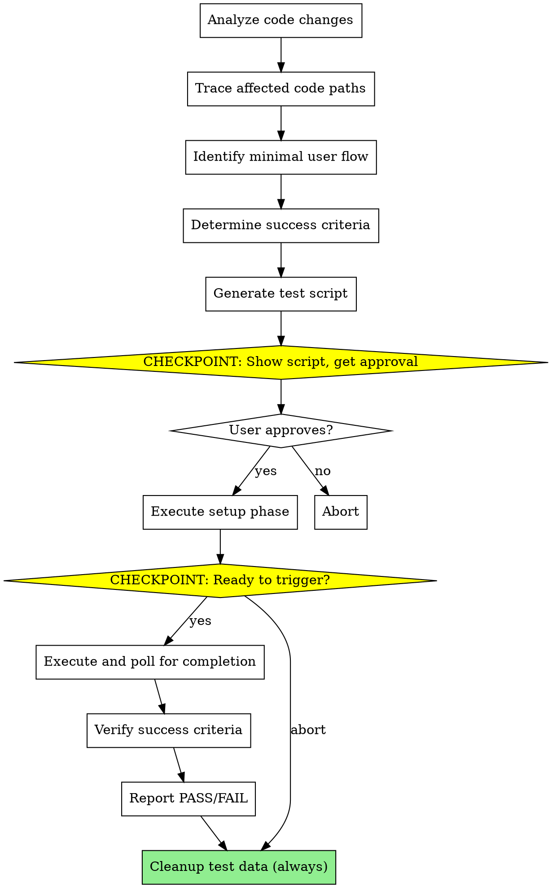

# AI-Driven Scenario Testing

Analyze code changes, identify which user flows exercise those code paths, generate minimal test scripts, and execute end-to-end scenario tests against production infrastructure with isolated test data.

**Core principle:** Test code changes with realistic user scenarios at minimal cost by reusing existing prod infrastructure and isolating test data through naming conventions.

## When to Use

- Infrastructure changes (Bicep, env vars, managed identity)
- Auth/credential changes that only work inside Azure
- Job orchestration logic (controller, failover)
- Integration points (LLM, email, blob storage)
- Any change that cannot be validated with local unit tests

## When NOT to Use

- **Pure unit-testable changes** — Use `pytest tests/unit` instead
- **Documentation-only changes** — README, comments, docs/
- **Frontend-only changes** — Use local dev server, Playwright
- **Changes already covered by CI** — If pushing to trigger CI anyway
- **Local config changes** — .env, local scripts

## Invocation

- Explicit: `/scenario-test`
- Natural: "test my changes", "verify this fix", "run scenario test"
- With scope: `/scenario-test HEAD~2..HEAD` or `/scenario-test "fixed managed identity auth"`

## The Process



## Phase 1: Analysis

### Step 1: Identify Changed Components

Read the git diff to understand what changed:

```bash
git diff HEAD~1..HEAD --name-only
git diff HEAD~1..HEAD
```

Map changed files to components:
- `src/providers/*.py` → Provider classes
- `src/jobs/*.py` → Job logic (controller, processor, poller)
- `src/services/*.py` → Business logic
- `src/api/*.py` → API endpoints
- `infra/*.bicep` → Infrastructure configuration

### Step 2: Trace Call Graph Upstream

For each changed component, trace who calls it:

```
Example: ContainerAppsProvider.start_job() changed
  ← called by: controller.py:trigger_processor_job()
  ← called by: controller.py:main()
  ← triggered by: Scheduled job OR manual trigger
  ← condition: pending_count >= 10 OR oldest_pending >= 7 days
```

### Step 3: Trace Call Graph Downstream

What happens after the changed code runs:

```
Example: start_job() succeeds
  → processor job starts
  → claims deliveries, transcribes, summarizes, emails
```

### Step 4: Identify Minimal Trigger Point

Determine what's needed to exercise the code path:

```
To exercise this code path, we need:
  - Pending deliveries in DB (to meet batch threshold)
  - Controller job to run

We do NOT need:
  - Real RSS feeds (deliveries inserted directly)
  - Real audio files (if testing auth, not processing)
  - Real email recipients (test user domain)
```

### Step 5: Determine Success Criteria

Select appropriate criteria based on what's being tested:

| Change Category | Success Criteria | Rationale |
|-----------------|------------------|-----------|
| Auth/Identity | Job execution exists, no auth errors | Auth happens at job start |
| Job orchestration | Correct job triggered, execution exists | Testing job selection logic |
| Transcription | Transcript blob created, non-empty | Need actual processing |
| Summarization | Summary blob created, content reasonable | Need LLM output |
| Email delivery | Delivery marked `sent`, no errors | Full end-to-end |
| API endpoints | HTTP 200, correct response | Direct API test |

## Phase 2: Script Generation

Generate a Python test script using the helper library. Save to `scripts/scenario_testing/generated/scenario_test_{description}_{uuid}.py`.

### Script Template

```python
#!/usr/bin/env python3
"""Scenario test: {description}

Auto-generated by scenario-test skill
Generated: {timestamp}
Cleanup: Automatic on completion/error

Code change tested:
    {file}: {change_summary}

Success criteria:
    {criteria}
"""

import sys
import uuid

sys.path.insert(0, ".")

from sqlalchemy import create_engine
from sqlalchemy.orm import sessionmaker

from scripts.scenario_testing import (
    # Constants
    CONTROLLER_JOB,
    # Test data
    cleanup_test_data,
    create_test_channel,
    create_test_deliveries,
    create_test_subscription,
    create_test_user,
    # Azure ops
    deploy_infra,
    get_job_logs,
    trigger_job,
    wait_for_job_completion,
    # Verification
    check_logs_for_errors,
    job_execution_exists,
    # Reporting
    report_failure,
    report_success,
)
from src.config import get_settings

TEST_ID = "{scenario}-{uuid}"


def get_db_session():
    settings = get_settings()
    engine = create_engine(settings.database_url)
    Session = sessionmaker(bind=engine)
    return Session()


def setup(db):
    """Insert test data into prod DB."""
    # Generated based on scenario requirements
    pass


def execute():
    """Trigger the flow and wait for completion."""
    # Generated based on what needs to be triggered
    pass


def verify(execution_name: str) -> bool:
    """Check success criteria."""
    # Generated based on success criteria
    pass


def cleanup(db):
    """Remove all test data."""
    cleanup_test_data(db, TEST_ID)


def main():
    db = get_db_session()
    try:
        setup(db)
        success, execution_name = execute()
        if not success:
            report_failure(f"Execution failed: {execution_name}")
            sys.exit(1)

        passed = verify(execution_name)
        if passed:
            report_success("Scenario test passed")
            sys.exit(0)
        else:
            logs = get_job_logs(CONTROLLER_JOB, execution_name)
            report_failure("Scenario test failed", logs)
            sys.exit(1)
    finally:
        cleanup(db)
        db.close()


if __name__ == "__main__":
    main()
```

## Phase 3: Checkpoint 1 - Script Approval

Present to user:
1. Summary of what changed
2. Code paths affected
3. Generated test script
4. What will be written to prod DB
5. Success criteria

Ask: "Ready to execute this test? [yes/modify/abort]"

## Phase 4: Setup Execution

If approved:
1. Deploy infrastructure changes if any: `deploy_infra("infra/main.bicep", "infra/parameters.prod.json")`
2. Insert test data using helper functions
3. Verify setup complete

## Phase 5: Checkpoint 2 - Trigger Approval

Present:
1. Setup complete confirmation
2. What job/API will be triggered
3. Expected behavior

Ask: "Ready to trigger the flow? [yes/abort]"

If abort: Run cleanup immediately.

## Phase 6: Execution

1. Trigger the job or API
2. Poll for completion (no artificial timeout)
3. Collect logs from relevant components
4. Report real-time status updates

## Phase 7: Verification

Check success criteria:
- Parse logs for error patterns
- Verify expected state changes
- Report PASS or FAIL with evidence

## Phase 8: Cleanup (Always Runs)

```python
cleanup_test_data(db, TEST_ID)
```

Report: "Cleanup complete. 0 test records remaining."

## Test Data Conventions

### Naming Patterns

| Entity | Pattern | Example |
|--------|---------|---------|
| Users | `test-{scenario}-{uuid}@podsum-test.local` | `test-auth-a1b2c3@podsum-test.local` |
| Channels | `TEST-{scenario}-{uuid}` | `TEST-auth-a1b2c3` |
| Auth tokens | Linked to test users only | — |
| Subscriptions | Linked to test users/channels | — |
| Episodes | Linked to test channels | — |
| Deliveries | Linked to test subscriptions | — |

### Isolation Guarantees

1. **Email safety:** Test users use `@podsum-test.local` domain which ACS rejects
2. **Query safety:** All test data queries filter by test prefixes
3. **Cascade cleanup:** Deleting test users cascades to related records

## Helper Library Reference

Import from `scripts.scenario_testing`:

### Test Data Creation
```python
create_test_user(db, test_id) -> User
create_test_channel(db, test_id) -> Channel
create_test_subscription(db, user, channel) -> Subscription
create_test_episode(db, channel, test_id) -> Episode
create_test_deliveries(db, subscription, count=10) -> list[Delivery]
```

### Azure Operations
```python
deploy_infra(bicep_path, parameters_path) -> bool
trigger_job(job_name) -> tuple[bool, str]
wait_for_job_completion(job_name, execution_name) -> JobStatus
get_job_logs(job_name, execution_name) -> str
```

### Verification
```python
job_execution_exists(job_name, execution_name) -> bool
check_logs_for_errors(logs, patterns=None) -> list[str]
check_blob_exists(container, path) -> bool
check_delivery_status(db, delivery_id) -> str | None
```

### Cleanup & Reporting
```python
cleanup_test_data(db, test_id) -> dict[str, int]
report_success(message)
report_failure(message, logs=None)
```

## Common Scenarios

### Managed Identity Fix

```
Changed: infra/main.bicep (AZURE_CLIENT_ID for controller)
Affects: DefaultAzureCredential in ContainerAppsProvider
Code path: controller → start_job() → Azure SDK auth
Trigger: Batch threshold met, controller runs
Success: Processor job execution exists, no auth errors
```

### Batch Threshold Change

```
Changed: src/jobs/controller.py (threshold logic)
Affects: When batch processing triggers
Code path: controller.main() → check_pending() → trigger_processor()
Trigger: Insert N pending deliveries, run controller
Success: Processor triggered (or not) per new threshold
```

### Email Template Change

```
Changed: src/services/delivery.py (email content)
Affects: Email body sent to users
Code path: processor → generate_email() → send_email()
Trigger: Full processing flow with test delivery
Success: Delivery marked sent, email content matches template
```

## Red Flags

| Mistake | Consequence | Prevention |
|---------|-------------|------------|
| Test data without unique ID | Collision with parallel runs | Always include UUID in test IDs |
| Forgetting cleanup on error | Orphaned test data in prod | `finally:` block always runs cleanup |
| Running against wrong environment | Test data in wrong place | Skill validates resource group |
| Wrong success criteria | Test passes but doesn't validate fix | Explain choice, user can override |
| Not deploying infra first | Testing old config | Deploy infra before inserting test data |
